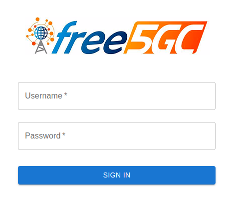
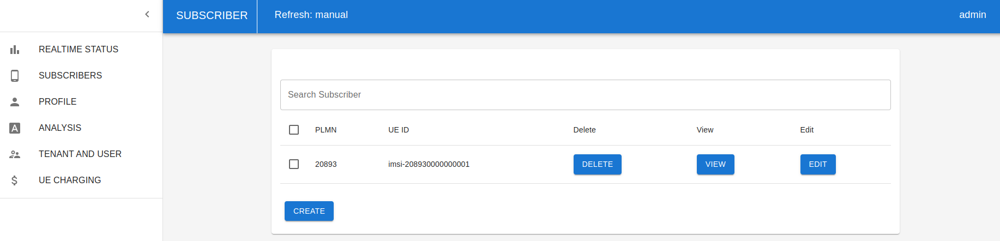

# **Demonstração simples de rede 5G emulada**
Este tutorial descreve os passos necessários para preparar e executar uma rede 5G emulada utilizando as seguintes aplicações open source:
- **5G Core**: free5GC;
- **gNB**: UERANSIM;
- **UE**: UERANSIM.

> **`Nota`**: este documento foi gerado com base [neste](https://free5gc.org/guide/0-compose/) tutorial.

# **Requisitos**
**Atenção:**
> **É necessário que a sua máquina (ou VM) seja de uma distribuição Linux (preferencialmente Ubuntu 22.04+) e possua suporte ao pacote de instruções AVX, pois o banco de dados (MongoDB) utilizado na aplicação do 5GC faz uso destas instruções em versões mais recentes.**
Caso sua máquina seja Linux, pode-se utilizar o seguinte comando para verificar se o pacote AVX é suportado:
```bash
lscpu | grep avx
```

Recomenda-se o uso de uma **máquina física** com pelo menos **8 núcleos de processamento e 16 GiB de RAM**, ou uma **VM** com **8 GiB de RAM e 4 núcleos de processamento** (o setup foi testado com a versão 22.04 server do Ubuntu). Recomenda-se também um **espaço livre no disco de 25 GiB**.

# **Preparação do setup**
## **Instalação do Wireshark**
Para que seja possível visualizar os pacotes que trafegarão pela rede 5G, é recomendada a instalação do Wireshark. Esta é uma ferramenta gratuita e útil para analisar a rede. Para usuários de Windows ou MacOS, o download da ferramenta pode ser feito [aqui](https://www.wireshark.org/download.html). Para usuários de Linux, é possível fazer o download utilizando o gerenciador de pacotes padrão do sistema (APT, DNF, etc) ou baixar o código fonte no link acima, extrair o conteúdo e compilar a aplicação.

## **Instalação do Docker**
O setup será executado utilizando a ferramenta Docker Compose, sendo necessário instalar a ferramenta Docker em sua máquina. Isto pode ser feito de maneira simples e gratuita fazendo o download do [Docker Desktop](https://www.docker.com/products/docker-desktop/) (suporte para Linux, MacOS e Windows).
Existem outras maneiras de [instalar o Docker](https://docs.docker.com/engine/install/) em sistemas operacionais Linux.

## **Instalação do módulo de kernel gtp5g**
Existe a possibilidade deste módulo não estar presente na máquina. Para verificar se ele está presente (carregado), execute o comando abaixo:
```bash
lsmod | grep gtp5g
```

Se apareceu algo na saída do comando, significa que ele está presente. Caso não tenha aparecido nada na saída do comando, verifique se o módulo existe no seu sistema com o seguinte comando:
```bash
modinfo gtp5g
```

Caso o módulo gtp5g não tenha sido encontrado. execute os comandos abaixo para compilá-lo e instalá-lo:
```bash
sudo apt install -y make build-essential gcc
git clone https://github.com/free5gc/gtp5g.git ~/gtp5g
cd ~/gtp5g && make -j $(nproc) && sudo make install && cd ~/
```

## Clonagem do repositório
Basta executar o comando abaixo:
```bash
git clone https://github.com/free5gc/free5gc-compose.git ~/free5gc-compose
```

# **Execução**
## 5G Core e gNB
Como o cenário utiliza a ferramenta Docker compose, basta executar os seguintes comandos:
```bash
cd ~/free5gc-compose
git checkout v4.0.1
sudo docker compose up
```

> **`Nota`**: é interessante iniciar a captura de pacotes com o Wireshark antes de executar o comando `docker compose up`, de forma que os pacotes trocados na rede 5G emulada possam ser capturados.

## Cadastro do usuário
É necessário cadastrar o usuário antes que ele tente conectar-se à rede, caso contrário ele será rejeitado no procedimento de conexão. Para cadastrar o usuário, basta acessar a URL disponibilizada pelo serviço `free5gc-webui` (nome do contêiner é `webui`). O formato é "http://<`IP da máquina`>:5000 :

<div align="center">
  
</div>

> **`Nota`**: as credenciais de acesso padrão são: **`admin`** (username) e **`free5gc`** (senha)

Após acessar a aplicação web, clique no item `Subscribers` do menu lateral esquerdo e clique em `Create` para cadastrar um novo usuário. Não é preciso alterar qualquer valor, basta clicar novamente em `Create` no final da página. Ao final do processo, você verá a lista de usuários cadastrados com um item, conforme é ilustrado abaixo:

<div align="center">
  
</div>

## Executar o UE
Para subir a aplicação do UE e tentar conectá-lo à rede, execute o comando abaixo:
```bash
sudo docker exec -it ueransim bash -c "./nr-ue -c config/uecfg.yaml"
```

## Teste de conectividade
Para validar a conexão, tente pingar o DNS do Google através da interface aérea emulada:
```bash
sudo docker exec -it ueransim bash -c "ping -I uesimtun0 8.8.8.8"
```

## Desativando o setup
É importante remover os volumes, as imagens e os contêineres que foram criados no setup, evitando que o disco seja ocupado de forma desnecessária. Para isso, execute os comandos a seguir:
```bash
cd ~/free5gc-compose
sudo docker compose down
sudo docker system prune -a --volumes -f
```